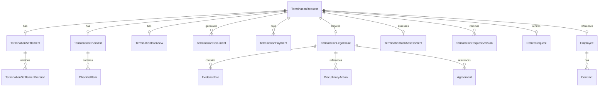

# Offboarding Domain Model v1.0

**Anexo técnico al Blueprint de Offboarding**  
**Audiencia:** Arquitectos, desarrolladores backend  
**Propósito:** Definir el modelo de dominio completo del módulo de Offboarding

---

## 1. Bounded Contexts

### 1.1 Mapa de Contextos

```
┌──────────────────────────────────────────────────────────────────┐
│                     VYKONE ECOSYSTEM                             │
│                                                                  │
│  ┌────────────────────┐    ┌────────────────────┐               │
│  │    CORE HR (CHR)   │    │     PAYROLL (PR)   │               │
│  │                    │    │                    │               │
│  │  ┌──────────────┐  │    │  ┌──────────────┐  │               │
│  │  │  Employee    │  │    │  │  PayPeriod   │  │               │
│  │  │  Contract    │  │    │  │  PayrollLine │  │               │
│  │  │  Vacation    │  │    │  │  TSSRecord   │  │               │
│  │  │  Leave       │  │    │  │  Concept     │  │               │
│  │  │  Evaluation  │  │    │  │  Accounting  │  │               │
│  │  │  Training    │  │    │  └──────────────┘  │               │
│  │  └──────────────┘  │    └────────────────────┘               │
│  └─────────┬──────────┘    └──────────┬─────────┘               │
│            │                          │                          │
│            ▼                          ▼                          │
│  ┌──────────────────────────────────────────────────────────┐   │
│  │                 OFFBOARDING CONTEXT (OB)                  │   │
│  │                                                          │   │
│  │  TerminationRequest ──── TerminationSettlement           │   │
│  │  TerminationRequest ──── TerminationChecklist            │   │
│  │  TerminationRequest ──── TerminationInterview            │   │
│  │  TerminationRequest ──── TerminationDocument[*]          │   │
│  │  TerminationRequest ──── TerminationPayment[*]           │   │
│  │  TerminationRequest ──── TerminationLegalCase            │   │
│  │  TerminationRequest ──── TerminationRiskAssessment       │   │
│  │  TerminationRequest ──── TerminationRequestVersion[*]    │   │
│  │  TerminationRequest ──── RehireRequest                   │   │
│  │                                                          │   │
│  │  ★ Aggregate Root: TerminationRequest                    │   │
│  │  ★ Value Objects: TerminationType, TerminationStatus     │   │
│  │  ★ Domain Events: 11 eventos                            │   │
│  │  ★ Rules Engine: TerminationRule                        │   │
│  └──────────────────────────────────────────────────────────┘   │
│            │                          │                          │
│            ▼                          ▼                          │
│  ┌────────────────────┐    ┌────────────────────┐               │
│  │   ASSETS (AST)     │    │   SECURITY (SEC)   │               │
│  │                    │    │                    │               │
│  │  ┌──────────────┐  │    │  ┌──────────────┐  │               │
│  │  │ Asset        │  │    │  │ UserSession  │  │               │
│  │  │ Assignment   │  │    │  │ APIKey       │  │               │
│  │  │ Tool         │  │    │  │ PortalAccess │  │               │
│  │  └──────────────┘  │    │  └──────────────┘  │               │
│  └────────────────────┘    └────────────────────┘               │
│                                                                  │
│  ┌────────────────────┐    ┌────────────────────┐               │
│  │  WORKFLOW (WF)     │    │    LEGAL (LEG)     │               │
│  │                    │    │                    │               │
│  │  ┌──────────────┐  │    │  ┌──────────────┐  │               │
│  │  │ StateMachine │  │    │  │ Lawsuit      │  │               │
│  │  │ Approval     │  │    │  │ Disciplinary │  │               │
│  │  │ StatusHistory│  │    │  │ Agreement    │  │               │
│  │  └──────────────┘  │    │  └──────────────┘  │               │
│  └────────────────────┘    └────────────────────┘               │
└──────────────────────────────────────────────────────────────────┘
```

---

## 2. TerminationRequest (Aggregate Root)

```python
class TerminationRequest(BaseModel):
    """
    Agregado raíz del proceso de offboarding.
    Toda operación de negocio debe pasar por esta entidad.
    """
    id: str = Field(default_factory=lambda: str(uuid4()))
    requestNumber: str = ""  # Formato: OFF-YYYY-NNNNN (auto-generado)

    # ── Relaciones ──
    employeeId: str = ""  ## FK → CoreHR.Employee.id
    employeeName: str = ""
    cedula: str = ""
    departmentId: str = ""
    positionId: str = ""
    supervisorId: str = ""

    # ── Datos de la solicitud ──
    requestDate: str = ""       # ISO date — fecha de creación
    effectiveDate: str = ""     # ISO date — fecha efectiva de salida
    lastWorkDate: str = ""      # ISO date — último día trabajado
    noticePeriodDays: int = 0   # Días de preaviso otorgados (si aplica)

    # ── Clasificación ──
    terminationType: TerminationType  # Ver sección 3
    terminationReason: str = ""
    detailedReason: str = ""
    initiatedBy: str = ""       # Email de quien inicia
    initiatedByRole: str = ""   # supervisor | hr | employee

    # ── Estado ──
    status: TerminationStatus = TerminationStatus.DRAFT

    # ── Evaluación de riesgo ──
    riskAssessmentId: str = ""  # FK → TerminationRiskAssessment.id

    # ── Fechas clave del proceso ──
    submittedAt: Optional[str] = None
    supervisorApprovedAt: Optional[str] = None
    hrApprovedAt: Optional[str] = None
    settlementCalculatedAt: Optional[str] = None
    settlementApprovedAt: Optional[str] = None
    assetsReturnedAt: Optional[str] = None
    accessRevokedAt: Optional[str] = None
    paidAt: Optional[str] = None
    documentsGeneratedAt: Optional[str] = None
    tssNotifiedAt: Optional[str] = None
    closedAt: Optional[str] = None

    # ── Aprobaciones ──
    approvalHistory: list[TerminationApproval] = []

    # ── Relaciones (FKs) ──
    settlementId: Optional[str] = None
    checklistId: Optional[str] = None
    interviewId: Optional[str] = None
    legalCaseId: Optional[str] = None
    rehireId: Optional[str] = None

    # ── Auditoría ──
    version: int = 1
    createdBy: str = ""
    createdAt: str = Field(default_factory=lambda: datetime.now(timezone.utc).isoformat())
    updatedBy: str = ""
    updatedAt: str = ""
    statusHistory: list[StatusChange] = []

    # ── Metadatos ──
    ownerUid: str = ""
    sandbox: bool = True
    tags: list[str] = []


class StatusChange(BaseModel):
    """Registro de cambio de estado inmutable."""
    fromStatus: str = ""
    toStatus: str = ""
    changedBy: str = ""
    changedAt: str = ""
    comment: str = ""
    source: str = ""  # "user" | "system" | "api"


class TerminationApproval(BaseModel):
    """Decisión de aprobación individual."""
    id: str = Field(default_factory=lambda: str(uuid4()))
    approverEmail: str = ""
    approverName: str = ""
    role: str = ""  # supervisor | hr | finance | treasury
    decision: str = ""  # approved | rejected
    comment: str = ""
    decidedAt: str = ""
    level: int = 1  # Nivel de aprobación (1, 2, 3...)
```

### 2.1 Reglas de Negocio

| Regla | Aplica en | Descripción |
|---|---|---|
| TR-R01 | Creación | `effectiveDate` no puede ser anterior a `requestDate` |
| TR-R02 | Creación | `employeeId` debe referenciar un empleado activo |
| TR-R03 | Transición | No se puede transicionar a `completed` si hay activos pendientes |
| TR-R04 | Transición | No se puede transicionar a `completed` si hay pagos pendientes |
| TR-R05 | SOD | `createdBy` ≠ `approvedBy` en cualquier nivel de aprobación |
| TR-R06 | SOD | `settlement.calculatedBy` ≠ `settlement.approvedBy` |
| TR-R07 | Completado | Todos los documentos obligatorios deben estar generados |
| TR-R08 | Cancelación | Solo RRHH o Admin pueden cancelar una solicitud aprobada |

---

## 3. TerminationType (Value Object)

```python
class TerminationType(str, Enum):
    """Catálogo completo de tipos de terminación laboral."""
    RENUNCIA_VOLUNTARIA      = "renuncia_voluntaria"        # LOW risk
    DESAHUCIO_EMPLEADOR      = "desahucio_empleador"        # MEDIUM risk
    DIMISION_JUSTIFICADA     = "dimision_justificada"       # MEDIUM risk
    DESPIDO_JUSTIFICADO      = "despido_justificado"        # HIGH risk
    DESPIDO_INJUSTIFICADO    = "despido_injustificado"      # HIGH risk
    MUTUO_ACUERDO            = "mutuo_acuerdo"              # MEDIUM risk
    JUBILACION               = "jubilacion"                 # LOW risk
    FALLECIMIENTO            = "fallecimiento"              # LOW risk
    FIN_CONTRATO_TEMPORAL    = "fin_contrato_temporal"      # LOW risk
    ABANDONO                 = "abandono"                   # HIGH risk
    OTRO                     = "otro"                       # MEDIUM risk (requiere nota)
```

### 3.1 Mapa de Riesgo

| Tipo | Riesgo | Prestaciones | Preaviso | Cesantía | Documentos obligatorios |
|---|---|---|---|---|---|
| renuncia_voluntaria | LOW | No | No | No | Carta renuncia, Certificación |
| desahucio_empleador | MEDIUM | Sí | Sí | Sí | Carta desahucio, Liquidación |
| dimision_justificada | MEDIUM | Sí | Sí | Sí | Carta dimisión, Liquidación |
| despido_justificado | HIGH | No | No | No | Carta despido, Pruebas |
| despido_injustificado | HIGH | Sí | Sí | Sí | Carta despido, Liquidación |
| mutuo_acuerdo | MEDIUM | Según acuerdo | Según acuerdo | Según acuerdo | Acuerdo firmado |
| jubilacion | LOW | Regalía+Vac | No | No | Certificación, Acta |
| fallecimiento | LOW | Regalía+Vac | No | No | Acta defunción |
| fin_contrato_temporal | LOW | Regalía+Vac | No | No | Fin contrato |
| abandono | HIGH | No | No | No | Comunicaciones |
| otro | MEDIUM | Según causa | Según causa | Según causa | Nota detallada |

---

## 4. TerminationStatus (Value Object)

```python
class TerminationStatus(str, Enum):
    """Máquina de estados del proceso de offboarding."""
    DRAFT                       = "draft"
    PENDING_SUPERVISOR_APPROVAL = "pending_supervisor_approval"
    PENDING_HR_APPROVAL         = "pending_hr_approval"
    APPROVED                    = "approved"
    PENDING_SETTLEMENT          = "pending_settlement"
    PENDING_ASSETS              = "pending_assets"
    PENDING_PAYMENT             = "pending_payment"
    PENDING_DOCUMENTS           = "pending_documents"
    PENDING_TSS                 = "pending_tss"
    COMPLETED                   = "completed"
    CANCELLED                   = "cancelled"
    REJECTED                    = "rejected"
```

---

## 5. TerminationSettlement

```python
class TerminationSettlement(BaseModel):
    """Cálculo de prestaciones laborales con versionado."""
    id: str = Field(default_factory=lambda: str(uuid4()))
    requestId: str = ""  ## FK → TerminationRequest.id

    # ── Datos de entrada ──
    hireDate: str = ""
    terminationDate: str = ""
    terminationType: TerminationType = TerminationType.RENUNCIA_VOLUNTARIA
    baseSalary: float = 0.0
    salaryFrequency: str = "mensual"
    monthlySalariesLast12: list[float] = []
    monthlySalariesYTD: list[float] = []
    preavisoTrabajado: bool = False

    # Vacaciones
    vacationPendingCompleteYears: int = 0
    vacationTakenCurrentPeriod: int = 0

    # Salario pendiente
    unpaidDays: int = 0  # Días trabajados no pagados
    pendingCommissions: float = 0.0
    pendingBonuses: float = 0.0
    pendingOvertime: float = 0.0

    # Descuentos
    loanDeductions: float = 0.0  # Préstamos pendientes
    advanceDeductions: float = 0.0  # Adelantos de sueldo
    otherDeductions: float = 0.0

    # ── Resultados ──
    antiguedad: dict = {}  # years, months, days
    salarioDiarioPromedio: float = 0.0
    conceptos: dict[str, ConceptoResult] = {}
    totales: Totales = Field(default_factory=Totales)

    # Conceptos extendidos
    salarioPendiente: float = 0.0
    comisionesPendientes: float = 0.0
    bonificacionesPendientes: float = 0.0
    horasExtrasPendientes: float = 0.0
    descuentos: float = 0.0
    montoNetoAPagar: float = 0.0

    # ── Estado ──
    status: str = "borrador"  # borrador | calculada | aprobada | pagada
    version: int = 1

    # ── Aprobación ──
    calculatedBy: str = ""
    calculatedAt: str = ""
    approvedBy: str = ""
    approvedAt: str = ""
    approvalComment: str = ""

    # ── Auditoría ──
    createdAt: str = ""
    updatedAt: str = ""
    previousVersionId: Optional[str] = None  ## Link a versión anterior


class ConceptoResult(BaseModel):
    """Resultado de un concepto individual en la liquidación."""
    aplica: bool = False
    dias: Optional[float] = None
    monto: float = 0.0
    detalle: str = ""
    exentoTSS: bool = True
    exentoISR: bool = True
    baseLegal: str = ""


class Totales(BaseModel):
    montoPrestaciones: float = 0.0       # Preaviso + Cesantía
    montoDerechosAdquiridos: float = 0.0 # Vacaciones + Navidad
    montoSalarioPendiente: float = 0.0   # Días no pagados
    montoComisiones: float = 0.0
    montoBonificaciones: float = 0.0
    montoHorasExtras: float = 0.0
    montoDescuentos: float = 0.0
    montoBruto: float = 0.0
    montoNeto: float = 0.0
    montoGravableTSS: float = 0.0
    montoGravableISR: float = 0.0
    montoExento: float = 0.0
```

---

## 6. TerminationChecklist

```python
class TerminationChecklist(BaseModel):
    """Checklist de devolución de activos y tareas de cierre."""
    id: str = Field(default_factory=lambda: str(uuid4()))
    requestId: str = ""
    employeeId: str = ""

    # Items agrupados por categoría
    items: list[ChecklistItem] = []

    # Totales
    totalItems: int = 0
    completedItems: int = 0
    allCompleted: bool = False

    # Cierre
    completedAt: Optional[str] = None
    completedBy: Optional[str] = None
    notes: str = ""


class ChecklistItem(BaseModel):
    id: str = Field(default_factory=lambda: str(uuid4()))
    task: str = ""
    category: ChecklistCategory = ChecklistCategory.ASSETS
    description: str = ""
    isMandatory: bool = True  # Si es mandatorio, bloquea transición a completed

    assignedAssetId: Optional[str] = None  # FK → Asset.id si aplica
    expectedReturnDate: Optional[str] = None

    completed: bool = False
    completedBy: Optional[str] = None
    completedAt: Optional[str] = None
    notes: str = ""

    # En caso de pérdida o daño
    hasIncident: bool = False
    incidentType: Optional[str] = None  # lost | damaged | not_returned
    incidentValue: float = 0.0
    chargeGenerated: bool = False
    chargeAmount: float = 0.0

    # Firma digital
    signedByEmployee: bool = False
    signedByHR: bool = False
    signatureUrl: Optional[str] = None


class ChecklistCategory(str, Enum):
    ASSETS  = "assets"   # Laptop, teléfono, vehículo, herramientas
    ACCESS  = "access"   # Sistemas, credenciales, llaves
    DOCS    = "docs"     # Documentos a firmar
    UNIFORM = "uniform"  # Uniformes, EPP
    FINANCE = "finance"  # Adelantos, préstamos a liquidar
    HR      = "hr"       # Carnet, expediente físico
```

### 6.1 Checklist por Defecto (Plantilla)

| # | Tarea | Categoría | Obligatorio |
|---|---|---|---|
| 1 | Devolver laptop/equipo asignado | ASSETS | ✅ |
| 2 | Devolver teléfono/celular | ASSETS | ✅ |
| 3 | Devolver vehículo asignado | ASSETS | ✅ |
| 4 | Devolver herramientas de trabajo | ASSETS | ✅ |
| 5 | Devolver uniformes y EPP | UNIFORM | ❌ |
| 6 | Devolver carnet de identificación | HR | ✅ |
| 7 | Devolver llaves de oficina/instalaciones | ACCESS | ✅ |
| 8 | Entregar credenciales de sistemas | ACCESS | ✅ |
| 9 | Liquidar adelantos de sueldo pendientes | FINANCE | ✅ |
| 10 | Firmar acta de devolución de activos | DOCS | ✅ |
| 11 | Firmar carta de desvinculación | DOCS | ✅ |
| 12 | Firmar liquidación y finiquito | DOCS | ✅ |

---

## 7. TerminationInterview

```python
class TerminationInterview(BaseModel):
    """Entrevista de salida del empleado."""
    id: str = Field(default_factory=lambda: str(uuid4()))
    requestId: str = ""
    employeeId: str = ""

    interviewDate: str = ""
    interviewerName: str = ""
    interviewerEmail: str = ""

    # Motivos
    primaryReason: str = ""      # Razón principal declarada
    secondaryReasons: list[str] = []

    # Preguntas estructuradas
    workEnvironment: int = 3      # 1-5
    compensation: int = 3         # 1-5
    management: int = 3           # 1-5
    growth: int = 3               # 1-5
    workLifeBalance: int = 3      # 1-5

    # Feedback libre
    whatWentWell: str = ""
    whatCouldImprove: str = ""
    wouldReturn: bool = True
    wouldRecommend: bool = True
    recommendations: str = ""

    # Documento
    documentFile: Optional[str] = None   # URL

    # Metadatos
    createdBy: str = ""
    createdAt: str = ""
    updatedAt: str = ""

    #[NOTA] La entrevista de salida es un paso opcional pero recomendado.
    # La empresa puede configurar si es obligatoria según el tipo de salida.
```

---

## 8. TerminationDocument

```python
class TerminationDocument(BaseModel):
    """Documento generado automáticamente durante el offboarding."""
    id: str = Field(default_factory=lambda: str(uuid4()))
    requestId: str = ""
    documentType: DocumentType = DocumentType.TERMINATION_LETTER

    # Numeración
    documentNumber: str = ""  # Formato: DOC-TYPE-YYYY-NNNNN
    controlNumber: str = ""   # Número de control interno (opcional)

    # Contenido
    title: str = ""
    content: str = ""  # HTML o Markdown del contenido generado
    fileUrl: Optional[str] = None  # URL al PDF generado
    fileSize: int = 0
    mimeType: str = "application/pdf"

    # Firmas
    signedByEmployer: bool = False
    signedByEmployerAt: Optional[str] = None
    signedByEmployee: bool = False
    signedByEmployeeAt: Optional[str] = None
    signatureMethod: str = ""  # "manual" | "digital" | "qr"

    # Verificación
    qrCode: Optional[str] = None   # Data URL del código QR
    verificationUrl: Optional[str] = None  # URL pública de verificación
    verificationCode: str = Field(default_factory=lambda: str(uuid4())[:12].upper())

    # Metadatos
    generatedBy: str = ""
    generatedAt: str = ""
    templateVersion: str = "1.0"
    language: str = "es"


class DocumentType(str, Enum):
    TERMINATION_LETTER         = "termination_letter"          # Carta de desvinculación
    DISMISSAL_LETTER           = "dismissal_letter"            # Carta de despido
    RESIGNATION_ACCEPTANCE     = "resignation_acceptance"      # Carta aceptación renuncia
    SETTLEMENT_ACTA            = "settlement_acta"             # Acta de liquidación
    PAYMENT_RECEIPT            = "payment_receipt"             # Recibo de pago
    WORK_CERTIFICATE           = "work_certificate"            # Certificación laboral
    ASSET_RETURN_ACTA          = "asset_return_acta"           # Acta devolución activos
    NON_DISCLOSURE             = "non_disclosure"              # Acuerdo de confidencialidad
    SETTLEMENT_AGREEMENT       = "settlement_agreement"        # Acuerdo de finiquito
    INTERVIEW_SUMMARY          = "interview_summary"           # Resumen entrevista salida
```

### 8.1 Documentos por Tipo de Salida

| Tipo de salida | Documentos obligatorios |
|---|---|
| renuncia_voluntaria | Carta aceptación renuncia, Certificación laboral, Acta liquidación |
| desahucio_empleador | Carta desahucio, Acta liquidación, Recibo pago |
| dimision_justificada | Carta dimisión, Acta liquidación, Recibo pago |
| despido_justificado | Carta despido, Certificación laboral |
| despido_injustificado | Carta despido, Acta liquidación, Recibo pago |
| mutuo_acuerdo | Acuerdo firmado, Acta liquidación, Certificación |
| jubilacion | Certificación, Acta de jubilación |
| fallecimiento | Acta defunción, Certificación, Acta liquidación |
| fin_contrato_temporal | Fin contrato, Certificación |
| abandono | Cartas de notificación, Comunicaciones |

---

## 9. TerminationPayment

```python
class TerminationPayment(BaseModel):
    """Registro de pago de liquidación."""
    id: str = Field(default_factory=lambda: str(uuid4()))
    requestId: str = ""
    settlementVersion: int = 1  # Versión de la liquidación que se paga

    paymentMethod: PaymentMethod = PaymentMethod.PAYROLL
    paymentDate: str = ""
    paymentReference: str = ""  # Número de referencia/cheque/transferencia

    # Montos
    totalAmount: float = 0.0
    conceptBreakdown: dict = {}  # {concepto: monto}

    # Si se paga vía nómina
    payrollPeriodId: Optional[str] = None
    payrollPeriodKey: Optional[str] = None

    # Si se paga por transferencia
    bankName: Optional[str] = None
    accountNumber: Optional[str] = None
    transferReference: Optional[str] = None

    # Comprobante
    receiptUrl: Optional[str] = None   # Comprobante de pago
    receiptNumber: Optional[str] = None

    # Contabilidad
    accountingEntryId: Optional[str] = None

    # Auditoría
    paidBy: str = ""
    paidAt: str = ""
    approvedBy: str = ""
    approvedAt: str = ""
    notes: str = ""


class PaymentMethod(str, Enum):
    PAYROLL     = "payroll"      # Nómina especial de liquidación
    TRANSFER    = "transfer"     # Transferencia bancaria
    CHECK       = "check"        # Cheque
    CASH        = "cash"         # Efectivo
    MIXED       = "mixed"        # Combinación
```

---

## 10. TerminationRiskAssessment

```python
class TerminationRiskAssessment(BaseModel):
    """Evaluación de riesgo legal de la desvinculación.

    Se crea al inicio del proceso y se actualiza si cambian las condiciones.
    """
    id: str = Field(default_factory=lambda: str(uuid4()))
    requestId: str = ""

    # Riesgo calculado
    riskLevel: LegalRiskLevel = LegalRiskLevel.LOW
    riskScore: int = 0  # 0-100

    # Factores que influyen
    riskFactors: list[RiskFactor] = []

    # Acciones recomendadas
    recommendedActions: list[str] = []

    # Revisión legal
    reviewedBy: Optional[str] = None
    reviewedAt: Optional[str] = None
    reviewNotes: str = ""

    # Metadatos
    assessedBy: str = ""
    assessedAt: str = ""
    updatedAt: str = ""


class LegalRiskLevel(str, Enum):
    LOW      = "low"       # 0-25: Sin exposición legal significativa
    MEDIUM   = "medium"    # 26-50: Exposición moderada, requiere precaución
    HIGH     = "high"      # 51-75: Exposición alta, requiere revisión legal
    CRITICAL = "critical"  # 76-100: Exposición crítica, requiere abogado


class RiskFactor(BaseModel):
    """Factor individual que modifica el riesgo."""
    factor: str = ""
    weight: int = 0     # Peso del factor (-50 a +50)
    description: str = ""
    source: str = ""    # Sistema o usuario que identificó el factor
```

### 10.1 Factores de Riesgo (Predefinidos)

| Factor | Peso | Aplica cuando |
|---|---|---|
| Antigüedad > 10 años | +15 | `employee.hireDate` hace >10 años |
| Antigüedad > 20 años | +25 | `employee.hireDate` hace >20 años |
| Salario > 10 salarios mínimos | +10 | `baseSalary` > 10× salario mínimo |
| Sin amonestaciones registradas | +10 | No hay acciones disciplinarias previas |
| Despido sin pruebas documentadas | +30 | No hay evidencias de la falta |
| Empleado con fuero sindical | +25 | `employee.isUnionMember` = true |
| Empleada embarazada | +40 | Fuero de maternidad |
| Litigio laboral previo contra la empresa | +20 | Historial de demandas del empleado |
| Testigos presenciales de la falta | -15 | Hay testigos documentados |
| Acuerdo firmado por el empleado | -20 | El empleado firmó aceptación |

---

## 11. TerminationLegalCase

```python
class TerminationLegalCase(BaseModel):
    """Expediente legal completo de la desvinculación."""
    id: str = Field(default_factory=lambda: str(uuid4()))
    requestId: str = ""
    employeeId: str = ""

    # Riesgo
    riskAssessmentId: Optional[str] = None

    # Estado legal
    hasLawsuit: bool = False
    lawsuitDetails: Optional[str] = None
    lawsuitNumber: Optional[str] = None
    lawsuitCourt: Optional[str] = None
    lawsuitDate: Optional[str] = None
    lawsuitStatus: str = ""  # filed | in_process | resolved | dismissed

    # Acciones disciplinarias relacionadas
    disciplinaryActionIds: list[str] = []

    # Acuerdos firmados
    agreementIds: list[str] = []

    # Evidencias
    evidenceFiles: list[EvidenceFile] = []

    # Abogado asignado
    legalCounselName: Optional[str] = None
    legalCounselEmail: Optional[str] = None

    # Resolución
    resolutionDate: Optional[str] = None
    resolutionAmount: float = 0.0  # Monto de conciliación o sentencia
    resolutionNotes: str = ""

    # Metadatos
    createdBy: str = ""
    createdAt: str = ""
    updatedAt: str = ""
    closedAt: Optional[str] = None


class EvidenceFile(BaseModel):
    """Archivo de evidencia en el expediente legal."""
    id: str = ""
    fileName: str = ""
    fileType: str = ""  # pdf | jpg | png | doc | mp4
    fileUrl: str = ""
    uploadedBy: str = ""
    uploadedAt: str = ""
    description: str = ""
    category: str = ""  # disciplinary | communication | agreement | other
```

---

## 12. RehireRequest

```python
class RehireRequest(BaseModel):
    """Solicitud de recontratación de un empleado previamente desvinculado.

    No es una simple reactivación. Es un nuevo proceso de contratación
    que preserva el historial anterior pero permite definir si la
    antigüedad es continua o se reinicia.
    """
    id: str = Field(default_factory=lambda: str(uuid4()))
    originalRequestId: str = ""     ## TerminationRequest original
    originalEmployeeId: str = ""    ## Employee.id original

    # Nueva contratación
    newEmployeeId: str = ""         ## Nuevo Employee.id (o el mismo)
    newHireDate: str = ""           # Fecha de reingreso
    newPosition: str = ""
    newDepartment: str = ""
    newSalary: float = 0.0
    newContractType: str = ""

    # Manejo de antigüedad
    preservesSeniority: bool = False    # ¿La antigüedad es continua?
    previousSeniorityDays: int = 0      # Antigüedad previa en días
    resetBenefits: bool = True          # ¿Reiniciar vacaciones y prestaciones?
    continuousSeniorityDate: str = ""   # Fecha desde la que cuenta antigüedad

    # Estado
    status: str = "draft"  # draft | approved | executed | cancelled

    # Aprobación
    approvedBy: Optional[str] = None
    approvedAt: Optional[str] = None
    approvalComment: str = ""

    # Auditoría
    createdBy: str = ""
    createdAt: str = ""
    executedAt: Optional[str] = None
```

### 12.1 Reglas de Recontratación

| Regla | Descripción |
|---|---|
| RH-R01 | No se puede recontratar si el empleado tiene litigio activo |
| RH-R02 | Si pasaron > 90 días desde la salida, la antigüedad se reinicia |
| RH-R03 | Si el reingreso es < 30 días, la antigüedad es continua por defecto |
| RH-R04 | El historial de vacaciones, evaluaciones y entrenamientos se preserva siempre |
| RH-R05 | Se genera un nuevo contrato, no se reactiva el anterior |

---

## 13. TerminationRequestVersion

```python
class TerminationRequestVersion(BaseModel):
    """Versionado inmutable de TerminationRequest.

    Cada vez que se modifica TerminationRequest, se crea una nueva versión.
    Nunca se sobrescribe una versión existente.
    """
    id: str = Field(default_factory=lambda: str(uuid4()))
    requestId: str = ""
    version: int = 1

    # Snapshot completo de TerminationRequest en ese momento
    snapshot: dict = {}

    # Diferencias con la versión anterior
    diff: dict = {}  # {"changedField": {"old": x, "new": y}}

    # Metadatos
    changedBy: str = ""
    changedAt: str = ""
    changeReason: str = ""
    changeSource: str = ""  # "user" | "system" | "api" | "transition"

    # Hash del snapshot (para verificar integridad)
    sha256: str = ""
```

---

## 14. TerminationRule (Motor de Reglas)

```python
class TerminationRule(BaseModel):
    """Regla de negocio parametrizable del módulo de offboarding.

    Permite configurar reglas sin hardcodearlas en los controladores.
    """
    id: str = Field(default_factory=lambda: str(uuid4()))
    code: str = ""  # Código único de la regla (ej: "NO_COMPLETAR_SIN_ACTIVOS")
    name: str = ""
    description: str = ""

    # ¿Dónde aplica?
    applyOnTransition: Optional[str] = None  # Estado destino
    applyOnAction: Optional[str] = None      # Acción específica

    # ¿Qué validar?
    validationType: str = ""  # "expression" | "function" | "query"
    validationExpression: str = ""  # Expresión evaluable (ej: "checklist.allCompleted == true")
    errorMessage: str = ""
    errorLevel: str = "error"  # "warning" | "error" | "block"

    # ¿Está activa?
    isActive: bool = True
    isMandatory: bool = False  # Si es mandatory, no se puede desactivar

    # ¿Para qué empresas/departamentos aplica?
    appliesToAll: bool = True
    appliesToDepartments: list[str] = []
    appliesToTerminationTypes: list[TerminationType] = []

    # Auditoría
    createdBy: str = ""
    createdAt: str = ""
    updatedBy: str = ""
    updatedAt: str = ""
```

### 14.1 Reglas por Defecto

| Código | Nombre | Aplica en | Acción |
|---|---|---|---|
| ASSETS-01 | No completar sin activos devueltos | completed | Bloquea si checklist.allCompleted == false |
| PAY-01 | No completar sin pago registrado | completed | Bloquea si no hay TerminationPayment |
| DOCS-01 | No completar sin documentos | completed | Bloquea si faltan documentos obligatorios |
| SOD-01 | Quien crea no aprueba | pending_hr_approval | Bloquea si createdBy == approvedBy |
| SOD-02 | Quien calcula no aprueba pago | pending_payment | Bloquea si calculador == pagador |
| RISK-01 | Riesgo alto requiere revisión legal | pending_hr_approval | Bloquea si riskLevel == HIGH sin revisión |
| RISK-02 | Riesgo crítico requiere aprobación dirección | pending_hr_approval | Bloquea si riskLevel == CRITICAL sin escalar |

---

## 15. Diagrama de Relaciones (Mermaid)



---

*Fin del documento de modelo de dominio.*  
*Versión 1.0 — Julio 2026*
