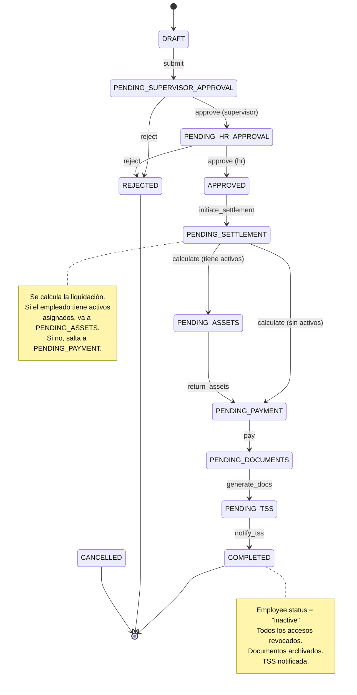

# Offboarding State Machine v1.0

**Anexo técnico al Blueprint de Offboarding**  
**Audiencia:** Desarrolladores backend, QA engineers  
**Propósito:** Definición formal del ciclo de vida del proceso de offboarding

---

## 1. Diagrama de Estados (Mermaid)



---

## 2. Catálogo de Estados

| # | Código | Nombre | Descripción | ¿Terminal? |
|---|---|---|---|---|
| 1 | `draft` | Borrador | Solicitud creada pero no enviada a aprobación | No |
| 2 | `pending_supervisor_approval` | Pendiente aprobación supervisor | Esperando decisión del jefe directo | No |
| 3 | `pending_hr_approval` | Pendiente aprobación RRHH | Esperando decisión del departamento de RRHH | No |
| 4 | `approved` | Aprobada | Solicitud aprobada, lista para procesar | No |
| 5 | `pending_settlement` | Pendiente liquidación | Esperando cálculo de prestaciones laborales | No |
| 6 | `pending_assets` | Pendiente activos | Esperando devolución de activos asignados | No |
| 7 | `pending_payment` | Pendiente pago | Esperando registro de pago | No |
| 8 | `pending_documents` | Pendiente documentos | Esperando generación de documentos legales | No |
| 9 | `pending_tss` | Pendiente baja TSS | Esperando registro en TSS | No |
| 10 | `completed` | Completada | Proceso finalizado exitosamente | Sí |
| 11 | `cancelled` | Cancelada | Proceso cancelado por decisión interna | Sí |
| 12 | `rejected` | Rechazada | Solicitud rechazada en aprobación | Sí |

---

## 3. Matriz de Transiciones Válidas

```
ESTADO_ORIGEN \ ESTADO_DESTINO
                              DRAFT  PSA  PHA  APR  PSE  PAS  PPA  PDO  PTS  CMP  CAN  REJ
─────────────────────────────────────────────────────────────────────────────────────────────
DRAFT                           ─    ✅    ❌   ❌   ❌   ❌   ❌   ❌   ❌   ❌   ✅   ❌
PENDING_SUPERVISOR_APPROVAL     ❌   ─    ✅   ❌   ❌   ❌   ❌   ❌   ❌   ❌   ✅   ✅
PENDING_HR_APPROVAL             ❌   ❌   ─    ✅   ❌   ❌   ❌   ❌   ❌   ❌   ✅   ✅
APPROVED                        ❌   ❌   ❌   ─    ✅   ❌   ❌   ❌   ❌   ❌   ✅   ❌
PENDING_SETTLEMENT              ❌   ❌   ❌   ❌   ─    ✅   ✅   ❌   ❌   ❌   ✅   ❌
PENDING_ASSETS                  ❌   ❌   ❌   ❌   ❌   ─    ✅   ❌   ❌   ❌   ✅   ❌
PENDING_PAYMENT                 ❌   ❌   ❌   ❌   ❌   ❌   ─    ✅   ❌   ❌   ✅   ❌
PENDING_DOCUMENTS               ❌   ❌   ❌   ❌   ❌   ❌   ❌   ─    ✅   ❌   ✅   ❌
PENDING_TSS                     ❌   ❌   ❌   ❌   ❌   ❌   ❌   ❌   ─    ✅   ✅   ❌
COMPLETED                       ❌   ❌   ❌   ❌   ❌   ❌   ❌   ❌   ❌   ─    ❌   ❌
CANCELLED                       ❌   ❌   ❌   ❌   ❌   ❌   ❌   ❌   ❌   ❌   ─    ❌
REJECTED                        ❌   ❌   ❌   ❌   ❌   ❌   ❌   ❌   ❌   ❌   ❌   ─
```

**Leyenda:**
- PSA = PENDING_SUPERVISOR_APPROVAL
- PHA = PENDING_HR_APPROVAL
- APR = APPROVED
- PSE = PENDING_SETTLEMENT
- PAS = PENDING_ASSETS
- PPA = PENDING_PAYMENT
- PDO = PENDING_DOCUMENTS
- PTS = PENDING_TSS
- CMP = COMPLETED
- CAN = CANCELLED
- REJ = REJECTED

---

## 4. Transiciones Detalladas

### 4.1 draft → pending_supervisor_approval

| Atributo | Valor |
|---|---|
| **Acción** | `submit` |
| **Descripción** | Enviar solicitud a aprobación del supervisor |
| **Ejecutor permitido** | Creador de la solicitud (supervisor o RRHH) |
| **Precondiciones** | `effectiveDate` no vacío, `terminationType` definido, `employeeId` válido |
| **Postcondiciones** | `submittedAt` = now, notificación al supervisor |
| **Reglas SOD** | Ninguna (quien crea puede enviar) |

### 4.2 pending_supervisor_approval → pending_hr_approval

| Atributo | Valor |
|---|---|
| **Acción** | `approve` (nivel supervisor) |
| **Descripción** | Supervisor aprueba la salida |
| **Ejecutor permitido** | Supervisor del empleado |
| **Precondiciones** | El empleado reporta al supervisor |
| **Postcondiciones** | Notificación a RRHH |
| **Reglas SOD** | `approverEmail` ≠ `createdBy` (opcional según config) |

### 4.3 pending_supervisor_approval → rejected

| Atributo | Valor |
|---|---|
| **Acción** | `reject` |
| **Descripción** | Supervisor rechaza la solicitud |
| **Ejecutor permitido** | Supervisor del empleado |
| **Precondiciones** | `comment` no vacío (razón del rechazo) |
| **Postcondiciones** | Notificación al creador, proceso termina |

### 4.4 pending_hr_approval → approved

| Atributo | Valor |
|---|---|
| **Acción** | `approve` (nivel RRHH) |
| **Descripción** | RRHH aprueba la desvinculación |
| **Ejecutor permitido** | Rol HR |
| **Precondiciones** | `riskAssessment` debe estar completado |
| **Postcondiciones** | Notificación, proceso listo para liquidación |
| **Reglas SOD** | `approverEmail` ≠ `createdBy` (obligatorio) |

### 4.5 pending_hr_approval → rejected

| Atributo | Valor |
|---|---|
| **Acción** | `reject` |
| **Descripción** | RRHH rechaza la solicitud |
| **Ejecutor permitido** | Rol HR |
| **Precondiciones** | `comment` no vacío |
| **Postcondiciones** | Notificación, proceso termina |

### 4.6 approved → pending_settlement

| Atributo | Valor |
|---|---|
| **Acción** | `initiate_settlement` |
| **Descripción** | Iniciar proceso de liquidación |
| **Ejecutor permitido** | Rol HR |
| **Precondiciones** | Riesgo legal evaluado, checklist iniciado |
| **Postcondiciones** | Se crea TerminationSettlement en estado "borrador" |

### 4.7 pending_settlement → pending_assets

| Atributo | Valor |
|---|---|
| **Acción** | `calculate` (con activos) |
| **Descripción** | Liquidación calculada, pendiente devolución activos |
| **Ejecutor permitido** | Rol HR (calculador) |
| **Precondiciones** | Settlement calculado y aprobado |
| **Postcondiciones** | `settlementCalculatedAt` = now, checklist activado |
| **Reglas SOD** | `calculatedBy` ≠ quien aprueba liquidación después |

### 4.8 pending_settlement → pending_payment

| Atributo | Valor |
|---|---|
| **Acción** | `calculate` (sin activos) |
| **Descripción** | Liquidación calculada, salta directamente a pago |
| **Ejecutor permitido** | Rol HR |
| **Precondiciones** | Empleado no tiene activos asignados (checklist vacío) |
| **Postcondiciones** | `settlementCalculatedAt` = now |

### 4.9 pending_assets → pending_payment

| Atributo | Valor |
|---|---|
| **Acción** | `return_assets` |
| **Descripción** | Todos los activos devueltos, listo para pago |
| **Ejecutor permitido** | Rol HR |
| **Precondiciones** | `checklist.allCompleted == true` |
| **Postcondiciones** | `assetsReturnedAt` = now |

### 4.10 pending_payment → pending_documents

| Atributo | Valor |
|---|---|
| **Acción** | `pay` |
| **Descripción** | Pago registrado |
| **Ejecutor permitido** | Rol Finance |
| **Precondiciones** | Monto aprobado por Finance, settlement.approvedBy no vacío |
| **Postcondiciones** | `paidAt` = now, se genera comprobante |
| **Reglas SOD** | `paidBy` ≠ `settlement.calculatedBy` |

### 4.11 pending_documents → pending_tss

| Atributo | Valor |
|---|---|
| **Acción** | `generate_docs` |
| **Descripción** | Documentos legales generados |
| **Ejecutor permitido** | Sistema (automático) |
| **Precondiciones** | Documentos obligatorios generados según tipo de salida |
| **Postcondiciones** | `documentsGeneratedAt` = now |

### 4.12 pending_tss → completed

| Atributo | Valor |
|---|---|
| **Acción** | `notify_tss` |
| **Descripción** | Baja registrada en TSS |
| **Ejecutor permitido** | Sistema (automático) o Rol HR (manual) |
| **Precondiciones** | Datos para novedad TSS generados |
| **Postcondiciones** | `tssNotifiedAt` = now, `closedAt` = now, employee.status = "inactivo", dominio events publicados |

### 4.13 Cualquier estado → cancelled

| Atributo | Valor |
|---|---|
| **Acción** | `cancel` |
| **Descripción** | Cancelar el proceso de offboarding |
| **Ejecutor permitido** | Rol HR o Admin |
| **Precondiciones** | `comment` no vacío |
| **Postcondiciones** | Proceso termina, empleado sigue activo, notificaciones de cancelación |

---

## 5. Transiciones Inválidas (Casos de Error)

| Transición inválida | Razón | Código de error |
|---|---|---|
| draft → approved | Saltar aprobaciones | ERR_SKIP_APPROVAL |
| pending_settlement → completed | Saltar activos, pago, documentos | ERR_SKIP_STEPS |
| approved → cancelled por creador | Solo RRHH puede cancelar después de aprobación | ERR_CANCEL_UNAUTHORIZED |
| pending_payment → pending_settlement | No se puede retroceder | ERR_ROLLBACK |
| completed → cualquier estado | Estado terminal, irreversible | ERR_TERMINAL_STATE |
| rejected → pending_hr_approval | No se puede reabrir sin nueva solicitud | ERR_REOPEN |

---

## 6. Permisos por Transición

| Transición | Quién puede ejecutarla |
|---|---|
| submit | Creador (supervisor o RRHH) |
| approve (nivel supervisor) | Supervisor del empleado |
| approve (nivel RRHH) | Rol HR (≠ creador) |
| reject | Supervisor o RRHH según nivel |
| initiate_settlement | Rol HR |
| calculate | Rol HR (calculador) |
| return_assets | Rol HR (verificador) |
| pay | Rol Finance |
| generate_docs | Sistema (automático) |
| notify_tss | Sistema o Rol HR |
| cancel | Rol HR o Admin |
| reopen | Solo Admin (situaciones excepcionales) |

---

## 7. Eventos de Dominio por Transición

| Transición | Evento publicado | Consumidor |
|---|---|---|
| draft → pending_supervisor_approval | `TerminationSubmitted` | Notifications |
| pending_supervisor_approval → pending_hr_approval | `TerminationApprovedBySupervisor` | Notifications |
| pending_hr_approval → approved | `TerminationApproved` | Payroll, Assets |
| approved → pending_settlement | `SettlementInitiated` | Payroll |
| pending_settlement → pending_assets | `SettlementCalculated` | Assets, Notifications |
| pending_assets → pending_payment | `AssetsReturned` | Security, Finance |
| pending_payment → pending_documents | `PaymentCompleted` | Documents |
| pending_documents → pending_tss | `DocumentsGenerated` | TSS |
| pending_tss → completed | `TerminationCompleted` | CoreHR, Dashboard, Analytics |
| cualquier → cancelled | `TerminationCancelled` | All contexts |
| cualquier → rejected | `TerminationRejected` | Creador |

---

## 8. Validación de State Machine (Código)

El módulo debe reutilizar el `StateMachineValidator` existente en VykOne:

```python
# app/services/state_machine.py (existente)
class StateMachineValidator:
    """Validador de transiciones de máquina de estados."""

    def __init__(self, states: dict):
        """
        Args:
            states: Dict con {state_name: {transitions: [lista], ...}}
        """
        self.states = states

    def validate_transition(self, current_state: str, target_state: str, entity_name: str):
        """Valida que la transición sea permitida. Lanza ValueError si no."""
        if current_state not in self.states:
            raise ValueError(f"Estado desconocido '{current_state}' para {entity_name}")
        allowed = self.states[current_state].get("transitions", [])
        if target_state not in allowed:
            raise ValueError(
                f"Transición inválida: {entity_name} no puede ir de "
                f"'{current_state}' a '{target_state}'. "
                f"Transiciones permitidas: {allowed}"
            )
        return True


# Definición de estados para Offboarding
OFFBOARDING_STATES = {
    "draft": {
        "transitions": ["pending_supervisor_approval", "cancelled"],
        "label": "Borrador",
    },
    "pending_supervisor_approval": {
        "transitions": ["pending_hr_approval", "rejected", "cancelled"],
        "label": "Pendiente aprobación supervisor",
    },
    "pending_hr_approval": {
        "transitions": ["approved", "rejected", "cancelled"],
        "label": "Pendiente aprobación RRHH",
    },
    "approved": {
        "transitions": ["pending_settlement", "cancelled"],
        "label": "Aprobada",
    },
    "pending_settlement": {
        "transitions": ["pending_assets", "pending_payment", "cancelled"],
        "label": "Pendiente liquidación",
    },
    "pending_assets": {
        "transitions": ["pending_payment", "cancelled"],
        "label": "Pendiente activos",
    },
    "pending_payment": {
        "transitions": ["pending_documents", "cancelled"],
        "label": "Pendiente pago",
    },
    "pending_documents": {
        "transitions": ["pending_tss", "cancelled"],
        "label": "Pendiente documentos",
    },
    "pending_tss": {
        "transitions": ["completed", "cancelled"],
        "label": "Pendiente baja TSS",
    },
    "completed": {
        "transitions": [],
        "label": "Completada",
        "terminal": True,
    },
    "cancelled": {
        "transitions": [],
        "label": "Cancelada",
        "terminal": True,
    },
    "rejected": {
        "transitions": [],
        "label": "Rechazada",
        "terminal": True,
    },
}
```

---

## 9. Precondiciones y Postcondiciones (Implementación)

```python
class TransitionValidator:
    """Validador de pre/post condiciones para cada transición."""

    PRECONDITIONS = {
        "pending_hr_approval → approved": [
            ("risk_assessment_completed", lambda req: req.riskAssessmentId is not None),
            ("creator_not_approver", lambda req: req.createdBy != current_user),
        ],
        "pending_assets → pending_payment": [
            ("all_assets_returned", lambda req: _checklist_completed(req.id)),
        ],
        "pending_payment → pending_documents": [
            ("settlement_approved", lambda req: _settlement_approved(req.id)),
            ("payment_registered", lambda req: _payment_exists(req.id)),
        ],
        "pending_tss → completed": [
            ("mandatory_docs_generated", lambda req: _docs_generated(req.id)),
        ],
    }

    POSTCONDITIONS = {
        "pending_tss → completed": [
            ("employee_inactivated", lambda req: _inactivate_employee(req.employeeId)),
            ("domain_events_published", lambda req: _publish_termination_completed(req)),
        ],
    }
```

---

*Fin del documento de state machine.*  
*Versión 1.0 — Julio 2026*
